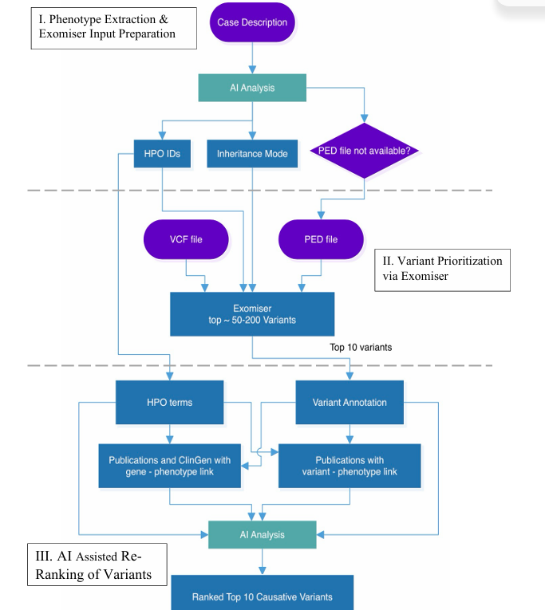
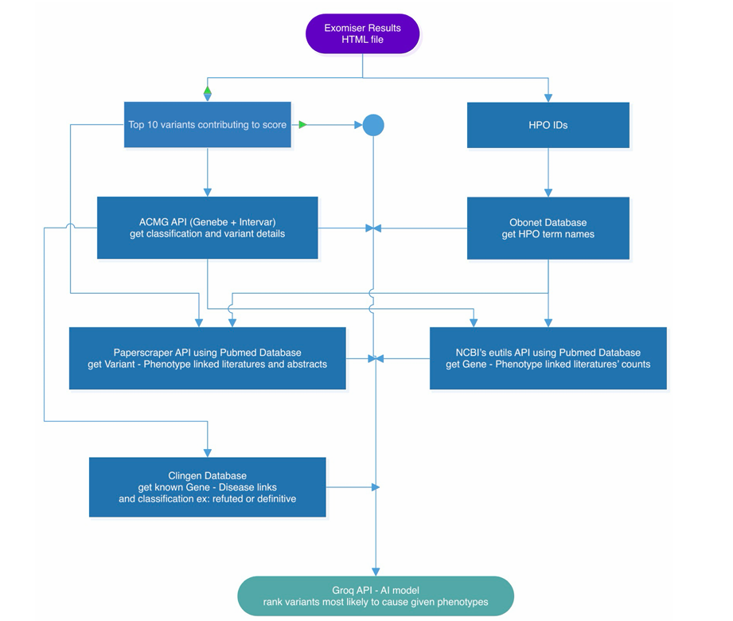
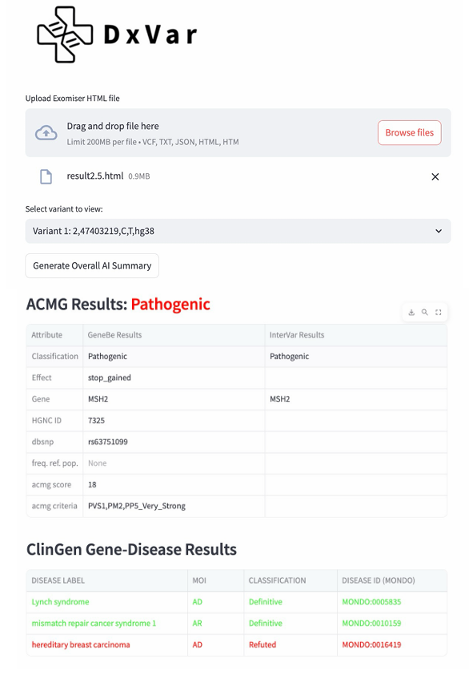
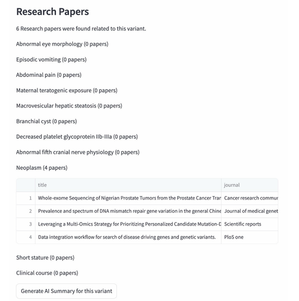
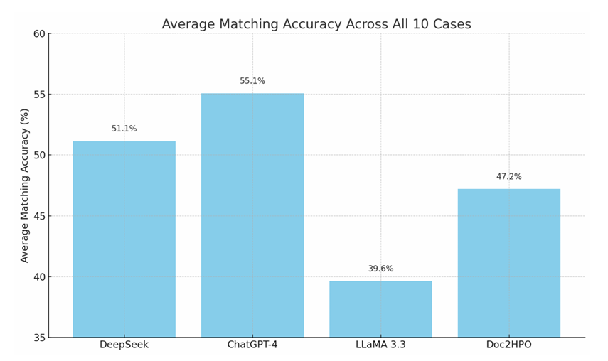
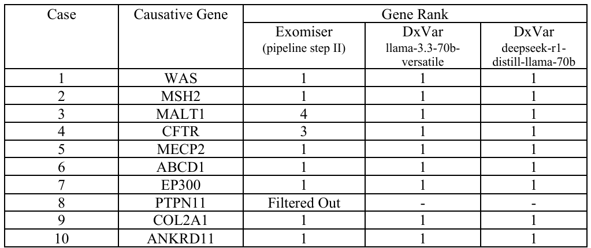

# DxVar – AI-Driven Genomic Variant Analysis Tool

AI-powered genomic variant prioritization platform for rare disease diagnosis using large language models, Exomiser, and biomedical literature analysis.

<p align="center">
  
</p>

---

# Overview

DxVar is an AI-assisted genomic analysis pipeline designed to improve rare disease variant prioritization and interpretation.

The platform integrates:
- HPO term extraction from clinical notes
- Exomiser-based variant prioritization
- AI-assisted variant re-ranking
- Biomedical literature analysis
- ClinGen and ACMG interpretation
- Streamlit-based clinician interface

The system combines bioinformatics pipelines with large language models to accelerate and improve variant interpretation workflows.

---

# Pipeline Architecture

<p align="center">
  
</p>

The DxVar pipeline operates in three major stages:

1. Phenotype extraction and Exomiser input preparation
2. Variant prioritization using Exomiser
3. AI-assisted re-ranking using literature and genomic databases

The system integrates phenotype information, inheritance prediction, pathogenicity scoring, and biomedical evidence into a unified ranking pipeline.

---

# Streamlit Interface

<p align="center">
  
</p>

The Streamlit interface provides:
- Variant browsing
- ACMG interpretation
- ClinGen gene-disease associations
- AI-generated summaries
- Linked biomedical literature
- Interactive variant analysis

---

# Research Paper Integration

<p align="center">
  
</p>

DxVar automatically retrieves:
- Variant-related publications
- Phenotype-linked papers
- Gene-disease associations
- Literature summaries

This enables clinicians and researchers to review supporting evidence directly within the platform.

---

# HPO Extraction Evaluation

<p align="center">
  
</p>

Different LLMs and phenotype extraction tools were benchmarked using GeneBreaker clinical cases.

Models evaluated:
- ChatGPT-4
- DeepSeek
- LLaMA 3.3
- Doc2HPO

The evaluation compared extracted HPO terms against reference annotations.

---

# Variant Prioritization Results

<p align="center">
  
</p>

DxVar’s AI-assisted re-ranking consistently improved variant prioritization performance compared to standalone Exomiser results.

Key findings:
- Exomiser ranked the causative gene first in 7/10 benchmark cases
- DxVar AI-assisted re-ranking placed the correct variant first in all analyzable cases
- The pipeline improved interpretability and clinical relevance

---

# Features

- Automated HPO term extraction
- AI-assisted inheritance prediction
- Exomiser integration
- AI-based variant re-ranking
- ClinGen integration
- ACMG classification support
- Biomedical literature mining
- Streamlit-based interactive UI
- Natural language disease interpretation
- Variant explanation summaries

---

# Technologies Used

## AI & Language Models

- LLaMA 3.3
- ChatGPT-4
- DeepSeek
- NLP-based phenotype extraction

## Bioinformatics

- Exomiser
- ClinGen
- OMIM
- GeneBe
- InterVar
- PubMed APIs

## Software & Frameworks

- Python
- Streamlit
- JSON
- REST APIs

---

# Results

| Metric | Result |
|---|---|
| Benchmark Dataset | 10 GeneBreaker cases |
| Exomiser First-Rank Success | 70% |
| DxVar AI Re-ranking Success | 100% |
| HPO Extraction Models Tested | 4 |
| Interface | Streamlit |
| Literature Integration | Yes |

---

# Key Engineering Concepts

- Phenotype-driven variant prioritization
- HPO term extraction
- Biomedical NLP
- AI-assisted clinical interpretation
- Genomic variant analysis
- Multi-stage ranking pipelines
- Explainable AI for healthcare
- Literature-based evidence retrieval

---

# Source Code Structure

```text
src/
├── phenotype_extraction/
├── exomiser_pipeline/
├── ai_reranking/
├── streamlit_interface/
└── literature_analysis/
```

---

# Future Work

- Larger clinical validation datasets
- Improved phenotype extraction accuracy
- Structural variant support
- Cloud deployment
- Smaller local LLM optimization
- Expanded multilingual support

---

# Documentation

- [Full Technical Report](docs/dxvar_report.pdf)
- [Project Presentation](docs/dxvar_presentation.pptx)

---

# Authors

- Hasan Al Hussein
- Omar Yousef
- Yaman Masad
- Wahaj Ahmed
- Huda Bamatraf

Khalifa University
